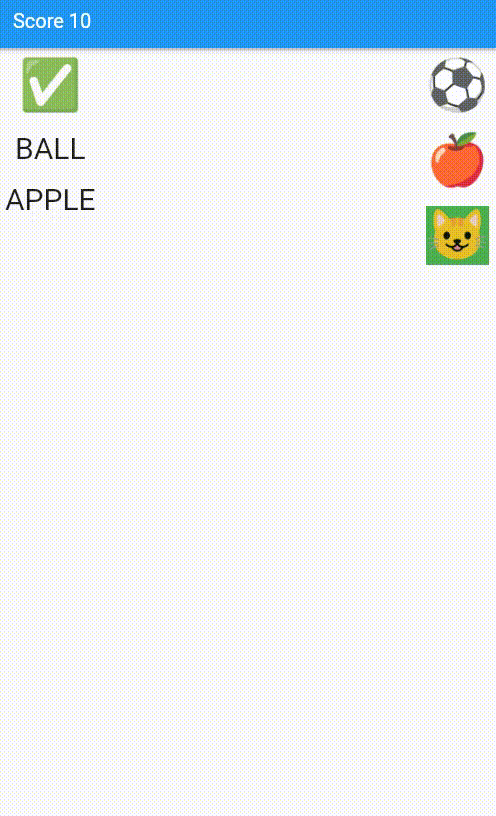

<!-- 
This README describes the package. If you publish this package to pub.dev,
this README's contents appear on the landing page for your package.

For information about how to write a good package README, see the guide for
[writing package pages](https://dart.dev/guides/libraries/writing-package-pages). 

For general information about developing packages, see the Dart guide for
[creating packages](https://dart.dev/guides/libraries/create-library-packages)
and the Flutter guide for
[developing packages and plugins](https://flutter.dev/developing-packages). 
-->
This package makes creating drag and drop matching UI easier.
**PACKAGE IS NOT YET READY FOR PRODUCTION**

## Features

Create drag and drop UI's with few lines of code
Useful for games and other interactive apps




## Getting started

Add the packages to pubspec and get started.

## Usage

```dart

final items = [
  DragDropItem(
      key: "apple",
      value: "apple",
      dragChild: Text(
        "APPLE",
        style: TextStyle(fontSize: 30),
      ),
      dropChild: Text(
        "🍎",
        style: TextStyle(fontSize: 50),
      ),
      iconData: Icons.one_k),
  DragDropItem(
      key: "ball",
      value: "Ball",
      dragChild: Text(
        "BALL",
        style: TextStyle(fontSize: 30),
      ),
      dropChild: Text(
        "⚽",
        style: TextStyle(fontSize: 50),
      ),
      iconData: Icons.one_k),
  DragDropItem(
      key: "cat",
      value: "Cat",
      dragChild: Text(
        "CAT",
        style: TextStyle(fontSize: 30),
      ),
      dropChild: Text(
        "😺",
        style: TextStyle(fontSize: 50),
      ),
      iconData: Icons.one_k)
];
```
Use the widget as,

```
DragDropWidget(
              items: items,
              //on  Matched event
              onMatched: (DragDropItem? item) {
                score += 10;
                setState(() {});
                matched.add(item);
                
                if (matched.length == items.length) {
                  print("GAME OVER");
                }
              },
              //on mismatched event
              onMisMatched: (DragDropItem? item) {
                print("Mismatched");
                print(item);
              });

```

## Additional information

To find more information about the package visit https://github.com/sabine33/flutter_drag_drop_match_widget
